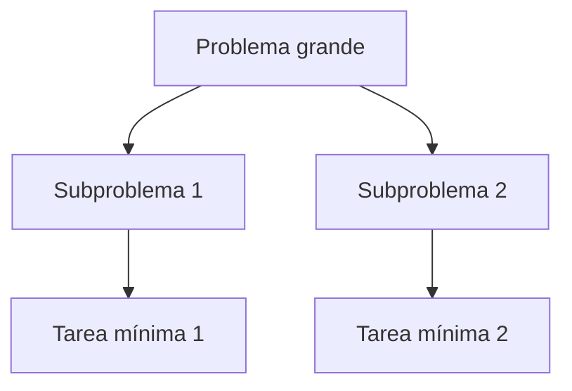

# 🔨 Estrategias de Resolución de Problemas en Programación

## 🔬 Concepto de Algoritmo

Un **algoritmo** es una secuencia ordenada de instrucciones que permiten resolver un problema o realizar una tarea. Ejemplo cotidiano:

#### ☕ Ejemplo: Hacer una taza de té

1. Hervir agua.
2. Colocar la bolsita en una taza.
3. Verter agua caliente.
4. Reposar 5 minutos.
5. Retirar la bolsita.

📅 **Importante**: Un mismo problema puede tener múltiples algoritmos válidos.

#### 📱 Ejemplo en software:

* **WhatsApp vs Telegram**: Ambos solucionan el problema de comunicación, pero con diferentes algoritmos.

#### ⚖️ Aplicaciones de algoritmos:

* Programación
* Criptografía
* Inteligencia Artificial

## 📊 Características de un buen algoritmo

| Característica | Descripción                                                 |
| -------------- | ----------------------------------------------------------- |
| 🧡 Robustez    | Considera todas las posibles situaciones del problema.      |
| ✔️ Correctitud | Da una solución válida al problema.                         |
| ⚡ Completitud  | Tiene todos los pasos necesarios para llegar a la solución. |
| ⚖️ Eficiencia  | Usa pocos recursos (tiempo, memoria).                       |
| ✅ Eficacia     | Logra resolver el problema.                                 |

> ⚠ Puede haber algoritmos eficaces pero no eficientes. Lo ideal es lograr ambas.

---

## 🧪 Pasos para resolver un problema

1. ✎ **Análisis** del problema.
2. 🖊️ **Diseño** del algoritmo (diagramas de flujo o pseudocódigo).
3. 💻 **Implementación** del algoritmo en un lenguaje de programación.

### ⚖ Atomización:

Descomponer el problema en tareas pequeñas y manejables:



## 🌐 Requerimientos Funcionales

Un **requerimiento funcional** describe lo que el software debe hacer:

> Ejemplo: "El sistema debe permitir agregar, eliminar y actualizar productos en inventario."

### 📚 Herramientas para documentar requerimientos

* GitHub / Gitea
* Trello
* ScrumDo

## 👥 Desglose de requerimientos de software

### 1. 💼 Detección de Usuarios y Roles

Ej.: Usuario final, Administrador

### 2. 📝 Detección de Necesidades

Ej.: Necesita conocer las funcionalidades del sistema.

### 3. ⚖ Detección de Acciones

Ej.: Registrar datos, consultar información, generar informes.

### 4. 📅 Tareas a desarrollar

Ej.: Codificar funcionalidades detectadas.

## 🪨 Ejemplo: Reemplazar una rueda pinchada (Pseudocódigo)

```pseudo
Inicio
  SI tengo el gato hidráulico
    Sacar el gato
    Poner el gato
    Aflojar tornillos
    Levantar coche
    Cambiar rueda
    Apretar tornillos
    Bajar el gato
  SINO
    Llamar al mecánico
FIN
```

## 🧰 Interpretación de Requerimientos Funcionales

**Enunciado base:** El sistema permite al usuario introducir nombres de programas y mostrar descripciones.

### 👥 Rol:

Usuario

### 🌟 Necesidad:

Conocer la utilidad de diferentes aplicaciones.

### 🔢 Acciones:

1. Introducir nombres
2. Mostrar descripciones
3. Volver a consultar

## 📚 Codificación sugerida (Ejemplo en C#)

```csharp
Console.WriteLine("Ingrese una palabra");
string palabra = Console.ReadLine();

Dictionary<string, string> diccionario = new Dictionary<string, string>();
diccionario.Add("navegador", "Permite acceder a sitios web.");

if (diccionario.ContainsKey(palabra)) {
    Console.WriteLine(palabra + ": " + diccionario[palabra]);
} else {
    Console.WriteLine("No existe en el diccionario.");
}
```

## ❓ Validación Inversa: ¿Quién? ¿Qué? ¿Para qué?

* **¿Quién?** Usuario
* **¿Qué?** Consultar descripciones de programas
* **¿Para qué?** Comprender su utilidad

> Si no puedo responder a estas preguntas, probablemente no haya comprendido el enunciado.

## ⏱ Conclusión

* No empieces a programar sin entender bien qué se necesita.
* Usa estrategias de análisis para evitar errores comunes.
* Comprender = Ahorrar tiempo = Mejor código

> ⚡ El tiempo es la unidad de medida del programador. Usalo con sabiduría.
