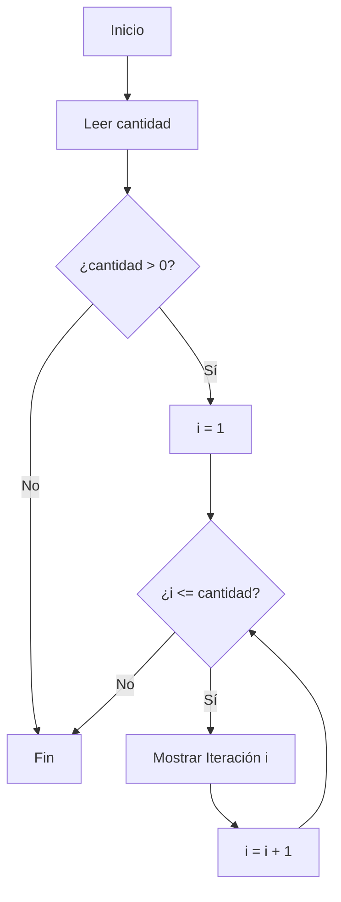

# 🔁🧠 Estructuras de Control Básicas

---

## 📌 ¿Qué son?

Las **estructuras de control** son herramientas que nos permiten:

- ✅ Tomar decisiones.
- 🔄 Repetir acciones.
- 🧱 Ejecutar instrucciones en orden.

Estas estructuras **controlan el flujo de ejecución** del programa.

---

## 🔍 Tipos principales

| Tipo              | Descripción breve                                    | Ejemplo común   |
| ----------------- | ---------------------------------------------------- | --------------- |
| 🧱 **Secuencial** | Instrucciones que se ejecutan una tras otra en orden | Línea por línea |
| 🔀 **Selección**  | Permite tomar decisiones según condiciones           | `if`, `if-else` |
| 🔁 **Repetición** | Ejecuta un bloque de código varias veces             | `for`, `while`  |

---

## ✨ Bloques de Código

Un **bloque de código** es un conjunto de instrucciones agrupadas que se ejecutan juntas.  
Por ejemplo, dentro de un `if` o un `for`, escribimos un bloque que **solo se ejecutará si la condición se cumple**.

---

## 🔂 Anidamiento

El **anidamiento** permite colocar estructuras dentro de otras estructuras.

- 🔁 Bucle dentro de otro bucle
- 🔀 `if` dentro de un `for`, o viceversa
- 🧩 Llamada a función dentro de otra función

📌 Sirve para construir **lógica compleja y modular**.

---

### 👇 Ejemplo de selección + repetición anidada (PSeInt)

```pseint
Definir i Como Entero

Escribir "¿Cuántas veces desea repetir?"
Leer cantidad

Si cantidad > 0 Entonces
    Para i <- 1 Hasta cantidad Con Paso 1
        Escribir "Iteración ", i
    FinPara
FinSi
```

---

## 🧭 Diagrama de flujo de ejemplo



Este diagrama representa el flujo del programa anterior, donde el bucle `Para` se ejecuta **solo si** la condición del `Si` es verdadera.

---

## ⚠️ Buenas prácticas al anidar

✔️ Usá anidamiento para dividir tareas complejas en pasos simples.  
🚫 Evitá anidar demasiadas estructuras (más de 3 niveles puede dificultar la lectura).  
📦 Considerá extraer lógica anidada a funciones o subprogramas.

---

## ✅ En resumen

- Las estructuras de control son clave para programar lógica.
- Podés combinarlas y anidarlas para lograr comportamientos complejos.
- El control del flujo es lo que le da "vida" a nuestros programas.

> 🎓 **Tip de profe**: Usar diagramas de flujo ayuda mucho a los estudiantes a visualizar **el orden de ejecución**. Usalos en tus prácticas 😉
