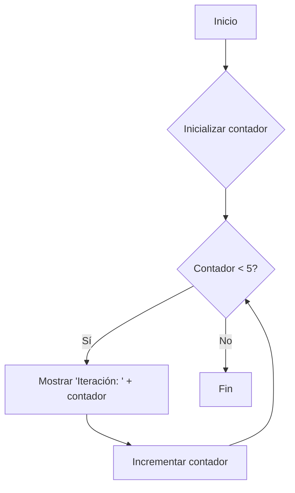

# 🔸 Estructuras de Repetición (Bucles)

## 🧭 ¿Qué son?

Las estructuras de repetición, comúnmente conocidas como **bucles** o **lazos**, son herramientas fundamentales en programación que permiten ejecutar un bloque de código de manera repetida. Esta ejecución se mantiene mientras se cumpla una condición específica, lo que las hace esenciales para automatizar tareas y procesar colecciones de datos.

Son la base para construir **algoritmos eficientes** que necesitan realizar acciones múltiples veces sin escribir el mismo código una y otra vez.

## 🧩 Tipos de estructuras de repetición

### 🔹 Bucle While (Mientras)

🔍 El bucle **While** ejecuta un bloque de instrucciones mientras una condición sea verdadera.

✅ La condición se evalúa antes de cada iteración. Si la condición es verdadera, el bloque de código se ejecuta. Este proceso se repite hasta que la condición se vuelve falsa.

❌ Si la condición es falsa desde el inicio, el bloque de código nunca se ejecutará.

Este tipo de bucle es ideal cuando **no se conoce de antemano** cuántas veces se necesita repetir el bloque de código, ya que su finalización depende de que la condición deje de cumplirse.

#### 📘 Sintaxis en PSeInt

```pseudocode
Definir contador Como Entero;
contador = 0;

Mientras contador < 5 Hacer
    Escribir "Iteración: ", contador;
    contador = contador + 1;
FinMientras
```

#### 💻 Sintaxis en C\#

```csharp
int contador = 0;
while (contador < 5) {
    Console.WriteLine("Iteración: " + contador);
    contador++;
}
```

#### 🔄 Diagrama de flujo (Bucle While)



### 🔸 Bucle For (Para)

🔍 El bucle **For** se utiliza cuando se **conoce de antemano** el número exacto de veces que se desea repetir un bloque de código.

✅ Su sintaxis compacta integra tres componentes clave:

- **Inicialización:** Se establece el valor inicial del contador.
- **Condición de continuación:** Se evalúa antes de cada iteración. Si es verdadera, el bucle continúa.
- **Expresión de actualización:** Se modifica el contador (incremento o decremento) después de cada iteración.

Si la condición es verdadera, se ejecuta el bloque de código y luego se actualiza el contador. Si la condición es falsa, el bucle se detiene.

#### 📘 Sintaxis en PSeInt

```pseudocode
Para contador = 0 Hasta 4 Con Paso 1 Hacer
    Escribir "Iteración: ", contador;
FinPara
```

#### 💻 Sintaxis en C\#

```csharp
for (int contador = 0; contador < 5; contador++) {
    Console.WriteLine("Iteración: " + contador);
}
```

#### 🔄 Diagrama de flujo (Bucle For)


## 🧠 En resumen

| Tipo de Bucle | ¿Cuándo usarlo?                                     | ¿Cómo se evalúa la condición?                                           |
| ------------- | --------------------------------------------------- | ----------------------------------------------------------------------- |
| While         | Cuando no se conoce el número exacto de iteraciones | Antes de cada iteración                                                 |
| For           | Cuando se conoce el número exacto de iteraciones    | Antes de cada iteración (con inicialización y actualización integradas) |

## 🧑‍🏫 Tip docente

Es crucial que los estudiantes comprendan la diferencia fundamental entre **While** y **For** en cuanto a cuándo se usan.

- **While** es para _"mientras esto sea cierto, hazlo"_.
- **For** es para _"hazlo X veces"_.

Además, recalcar la importancia de que la condición del bucle eventualmente se vuelva falsa para **evitar bucles infinitos**.
