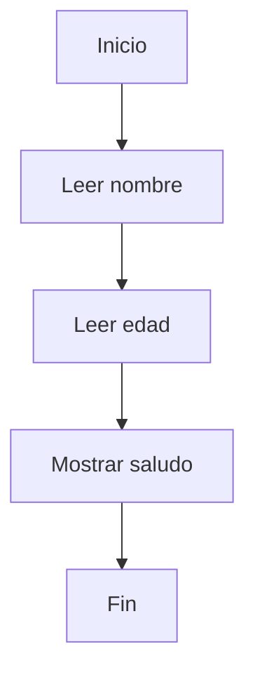

# 🔹 Estructura Secuencial

La **estructura secuencial** es la más simple y fundamental de todas las estructuras de control.  
Consiste en ejecutar una **serie de instrucciones una tras otra**, **en orden**, sin saltos, sin condiciones y sin repeticiones.

🔤 Se comporta como una **lista de pasos que deben ejecutarse tal como están escritos**.

---

## 🧱 Características

✅ Ejecuta instrucciones **en orden**  
❌ No toma decisiones  
❌ No repite instrucciones  
🧭 Flujo de ejecución **de arriba hacia abajo**

---

## 🔍 Ejemplo (PSeInt)

```pseint
Definir nombre Como Cadena
Definir edad Como Entero

Escribir "Ingrese su nombre:"
Leer nombre

Escribir "Ingrese su edad:"
Leer edad

Escribir "Hola ", nombre, ", tenés ", edad, " años."
```

🎯 En este caso, **cada línea se ejecuta una después de la otra**, sin interrupciones.

---

## 🧭 Diagrama de flujo



📌 Observá cómo el flujo **es lineal**, sin decisiones ni bucles. Cada instrucción se ejecuta exactamente una vez.

---

## ✅ ¿Cuándo usar estructuras secuenciales?

- Para instrucciones simples y lineales.
- Para tareas que **no dependen de condiciones**.
- Cuando el orden de ejecución es **estrictamente necesario**.

---

## 🧠 En resumen

| Ventaja                           | Desventaja                               |
| --------------------------------- | ---------------------------------------- |
| ✔️ Simples de entender y escribir | ❌ Poco flexibles para lógica compleja   |
| ✔️ Base de todo algoritmo         | ❌ No permite decisiones ni repeticiones |

> 🧑‍🏫 **Tip docente:** Siempre es buena idea iniciar a los estudiantes con estructuras secuenciales antes de introducir condiciones o bucles. Ayuda a entender el **flujo natural** del programa.
