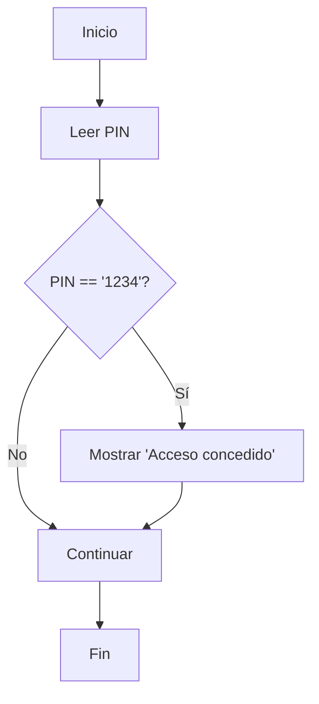
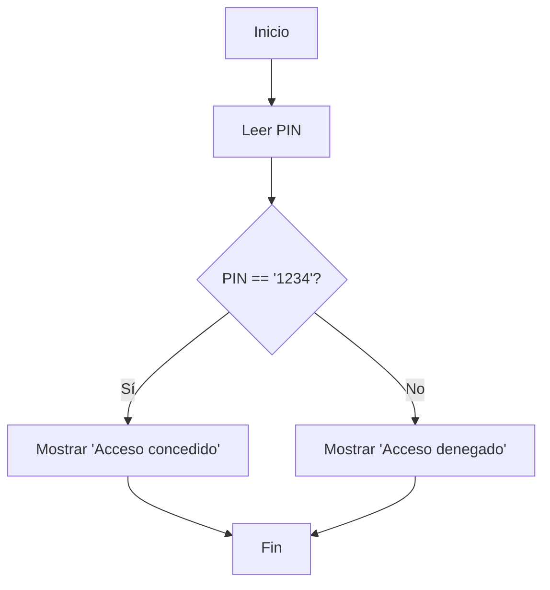

# 🔸 Estructuras de Selección o Selectiva

## 🧭 ¿Qué son?

Las **estructuras de selección** permiten que un programa tome decisiones, ejecutando distintos bloques de código según se cumpla o no una condición.  
Son fundamentales para agregar **lógica y comportamiento dinámico** a los algoritmos.

---

## 🧩 Tipos de estructuras selectivas

### 🔹 Selección Simple (`if`)

🔍 Evalúa una **única condición**.  
✅ Si es verdadera, se ejecuta el bloque de instrucciones.  
❌ Si es falsa, se salta el bloque y continúa el programa.

### 📘 Sintaxis en PSeInt

```pseint
Definir pin como cadena;
Escribir "Ingrese su clave pin";
Leer pin;

Si pin == "1234" Entonces
    Escribir "Acceso concedido";
FinSi
```

### 💻 Sintaxis en C#

```csharp
string pin;
Console.WriteLine("Ingrese su clave pin");
pin = Console.ReadLine();

if(pin == "1234") {
    Console.WriteLine("Acceso concedido");
}
```

### 🔄 Diagrama de flujo (Selección Simple)



---

### 🔸 Selección Doble (`if-else`)

🔍 Evalúa una condición y, dependiendo del resultado:

- ✅ Ejecuta un bloque si la condición es verdadera.
- ❌ Ejecuta **otro bloque alternativo** si la condición es falsa.

### 📘 Sintaxis en PSeInt

```pseint
Definir pin como cadena;
Escribir "Ingrese su clave pin";
Leer pin;

Si pin == "1234" Entonces
    Escribir "Acceso concedido";
SiNo
    Escribir "Acceso denegado";
FinSi
```

### 💻 Sintaxis en C#

```csharp
string pin;
Console.WriteLine("Ingrese su clave pin");
pin = Console.ReadLine();

if(pin == "1234") {
    Console.WriteLine("Acceso concedido");
} else {
    Console.WriteLine("Acceso denegado");
}
```

### 🔄 Diagrama de flujo (Selección Doble)



---

## 🧠 En resumen

| Tipo de selección | ¿Qué evalúa?           | ¿Qué hace si es falsa?           |
| ----------------- | ---------------------- | -------------------------------- |
| `if`              | Una condición booleana | Omite el bloque de instrucciones |
| `if-else`         | Una condición booleana | Ejecuta un bloque alternativo    |

---

> 🧑‍🏫 **Tip docente:** Es importante que los estudiantes entiendan que el resultado de la condición siempre se evalúa como **`true` o `false`**. A partir de ahí, el flujo del programa puede **ramificarse**.
